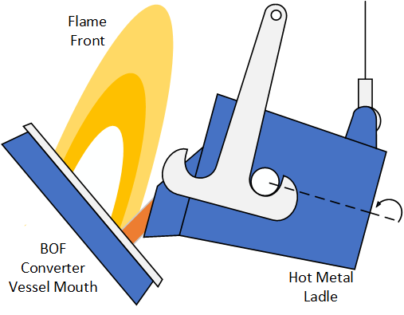

# Hot Metal Ladle Tracking


# Background
Pouring of hot metal into basic oxygen furnace vessels through hot metal ladles is a critical step that is carried out during the steelmaking process. It is typically performed manually by operators and is associated with challenges such as operational variability due to inconsistent human performance, harmful emissions due to the intense reactions occurring within the furnace, as well as equipment degradation which occurs due to said reactions impacting surrounding equipment. These challenges drive process optimisation which in the context of this case study, can be used to standardise the process, minimise emissions and extend the useful life of equipment.

The source code in this repository accompanies the research conducted as part of Case Study 1: Hot Metal Ladle Tracking.



# Acknowledgements

**Mask R-CNN**
Copyright (c) 2017 Matterport, Inc.
Licensed under the MIT License
Written by Waleed Abdulla


**Kalman filtering**
Rahmad Sadli

# Setup
## Anaconda environment
To replicate the anaconda environment used for this study:

 1. Clone the repository

 2. Set the current directory to Hot-Metal-Ladle-Tracking

 3. Execute the following command in Anaconda prompt:


	```conda env create -f mrcnn_environment.yml```


## Model Training

Once the environment is set up, set the current direction to 'Hot-Metal-Ladle-Tracking > Mask_RCNN > mrcnn' and execute:

```python ladle.py train --dataset=(insert dataset path) --weights=(insert weights path, or just use 'coco')```

to train the model.

## Inference

 - `load_video.py` is the inference script, that is built to run from
   Spyder IDE.
   
 - `load_video2.py` is the inference script adapted for Kalman filtering.
 - **Paths** to the weights file and dataset folder are required for
   inference. They are already defined but will need adjustment for any future work.


# Example Results (currently blocked for confidentiality)

Example video outputs are included in this repository and are as follows:

 - **maskpool_7.mp4:** Mask R-CNN video segmentation
 
 - **maskpool_3_kalman.mp4:** Mask R-CNN + Kalman filtering video segmentation
 - **flameSeverity4.mp4:** Mask R-CNN video segmentation with pouring parameters and flame severity estimations

# Code Quality and Contribution Guidelines
The source code in this repository accompanies the research conducted as part of Case Study 1: Hot Metal Ladle Tracking. 

The code focuses on application of computer vision to the steel industry and is shared for collaboration and contribution purposes. 

Every effort has been made to ensure quality and readability, however this may further improve over time.

Feedback and contributions that enhance the functionality of the code are welcome.

# Publication

A paper has been published on this work in The International Journal of Advanced Manufacturing Technology (IJAMT), and is available at: [https://doi.org/10.1007/s00170-023-11151-4](https://doi.org/10.1007/s00170-023-11151-4)

```
