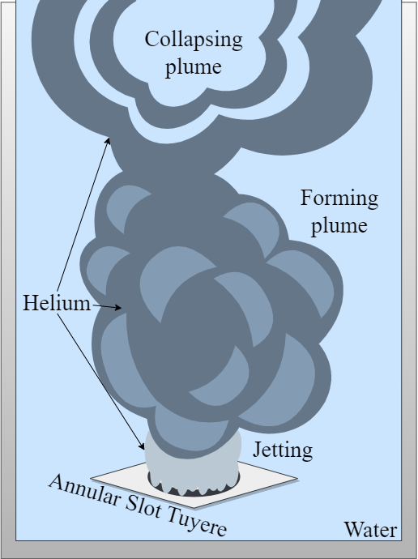

# Plume Monitoring


# Background
During steel production, the refinement process within the basic oxygen furnace (BOF) is a process that if optimised, could significantly enhance the efficiency and sustainability of steel production. Gas stirring is a technique that facilitates improved mixing between steel and slag which increases yield and scrap charge, improves phosphorus removal, reduces skulling and reduces consumption of aluminium and flux. However, gas injection into the BOF is achieved via a mixing element and this technique has been found to increase wear on the refractory lining surrounding the mixing element. This is due to thermo-mechanical stresses from gas injection and compressive failure of the refractory material. Previous approaches for assessing this wear include time-domain reflectometry, laser scanning and temperature monitoring, which offer valuable insights but are limited by their static nature and point-specific measurements.

In this work, a novel approach is presented which utilises machine learning-based computer vision (CV) to monitor a variety of plume characteristics from footage of experiments captured in a physical model that simulates gas stirring in the BOF. The simulation uses water as liquid steel and helium as the injected gas. The CV model developed uses the YOLOv5 network for plume detection, DeepSORT for plume tracking and counting background subtraction for plume segmentation. Through this innovative approach, measured plume characteristics have been used to assess wear rate and stirring efficiency of different gas stirring configurations with an annular tuyère element design. The assessment provided by this model can be used to optimise configurations for reduced wear and increased stirring efficiency, leading to extended equipment life, enhanced product quality and reduced material and energy wastage.

The source code in this repository accompanies research conducted as part of Case Study 3: Plume Monitoring.



# Acknowledgements

**YOLOv5**
Copyright (c) 2023 Ultralytics LLC. 
Licensed under the GNU General Public License v3.0 
Developed by Ultralytics

# Setup (Guidance available on Colab)

Open the Colab Notebook and follow the instructions. It may be necessary to compress the ```yolov5_setup2``` folder into a .rar file before uploading it to Colab.

# Example Results (currently blocked for confidentiality)

Example video outputs are included in this repository and are as follows:

 - **plume100_exp8.mp4:** Model results on plume100
 
 - **plume120_exp8.mp4:** Model results on plume120
 

# Code Quality and Contribution Guidelines
The source code in this repository accompanies research conducted as part of Case Study 3: Plume Monitoring. 

The code focuses on application of computer vision to the steel industry and is shared for collaboration and contribution purposes. 

Every effort has been made to ensure quality and readability, however this may further improve over time.

Feedback and contributions that enhance the functionality of the code are welcome.

