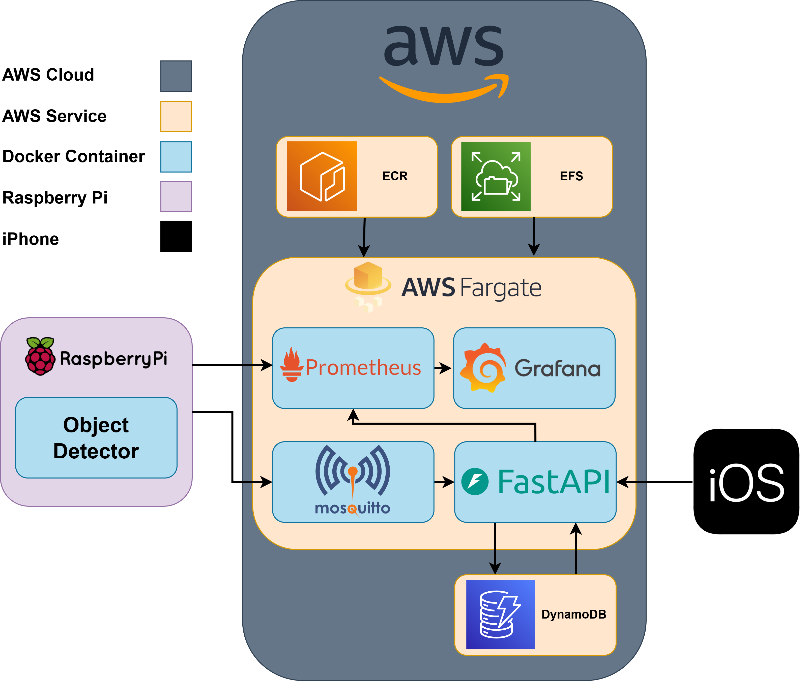

# 👥 People Counter: Edge-Cloud-iOS Computer Vision System

## 📘 Background

This project explores a scalable computer vision system for counting people entering and exiting a space. Designed for edge deployment (Raspberry Pi + iPhone), it integrates real-time detection with cloud-based monitoring and analytics. The goal is to create a lightweight, robust solution that can provide actionable footfall insights for physical spaces like gyms, cafes, or small shops.

It also serves as an end-to-end application of my experience in computer vision, edge computing, and MLOps.

---

## 🏗️ System Architecture

*Overview of diagram here*

Key technologies:
- **Raspberry Pi** for on-device detection
- **MQTT** for lightweight IoT messaging
- **FastAPI** for the backend REST API
- **Docker** for service containerisation
- **Prometheus + Grafana** for metrics and monitoring
- **GitHub Actions** for automated testing and deployment
- **AWS** for ECR, ECS, EFS, DynamoDB
- **Swift** for delivery via iOS app

---

## 🌍 Real-World Application

This system is aimed at real environments with limited resources and minimal IT overhead. Potential use cases:
- Counting footfall in gyms to track peak times
- Monitoring entrances to manage occupancy limits
- Informing staffing or advertising decisions based on customer flow

---

## 🚧 Status

> 🔨 **In Progress**: Currently finishing the CI/CD pipeline for a single-camera prototype. Multi-camera system planned for the next version.

---

## 🙏 Acknowledgements

Placeholder.

